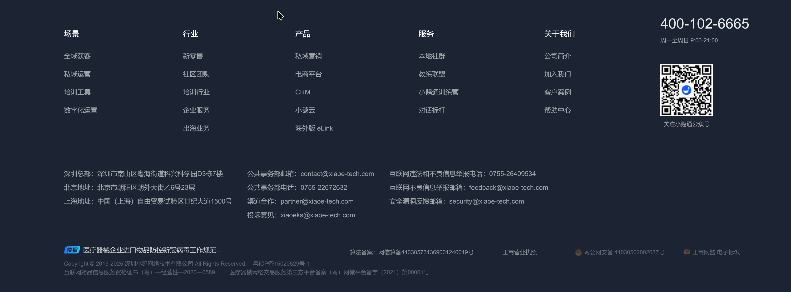

# lean-web

教学系统主战静态项目

## 采用架构
- 采用angular 21 作为基础框架
- 采用angular material 作为ui框架
- 采用angular flex-layout 作为响应式布局
- 采用angular flex 作为响应式布局
- 采用angular animations 作为动画

## 项目结构
- src/app
- src/assets
- src/environments
- src/index.html
- src/main.ts
- src/polyfills.ts
- src/styles.css

## 项目运行  支持dev和prod环境 支持 docker 打包部署
- ng serve
- ng build
- ng build --prod
- ng build --prod --base-href /lean-web/

## ui要求

- 根据 目录中的ppt文件作为展示参考 和 ui 展现
- 增加 固定的顶部菜单栏  和 最下面的 网站信息说明, 版权信息等,具体格式可以参考 这个图片的格式
- 界面 要求现代时尚
